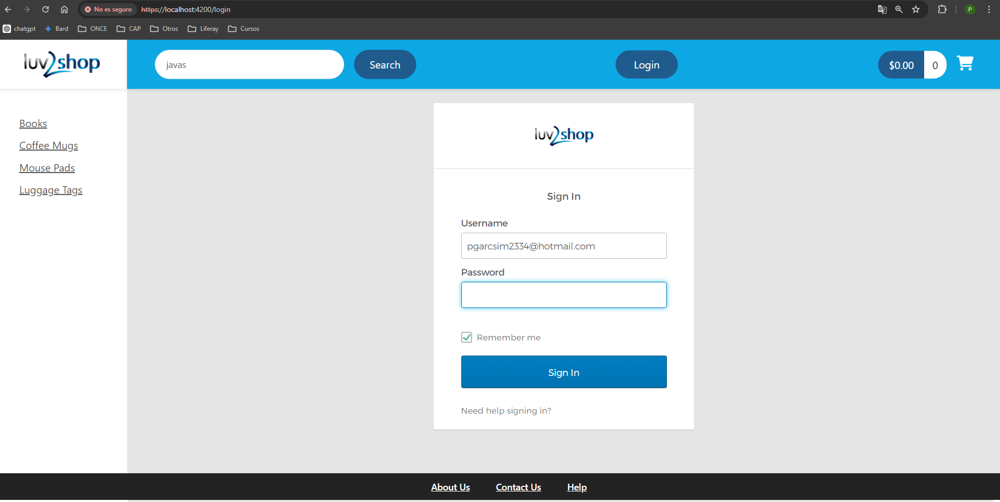
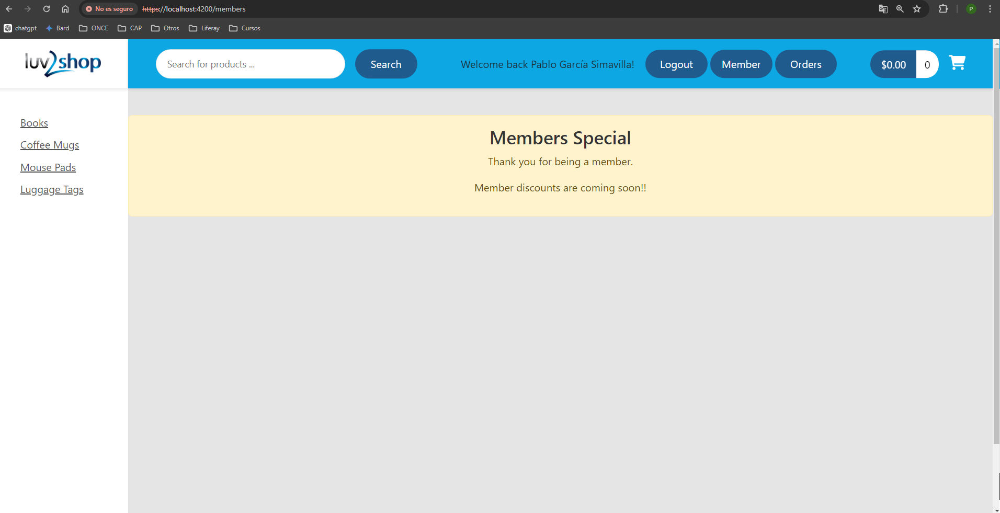
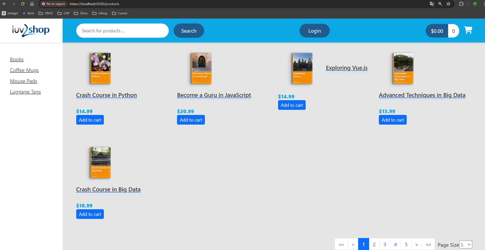
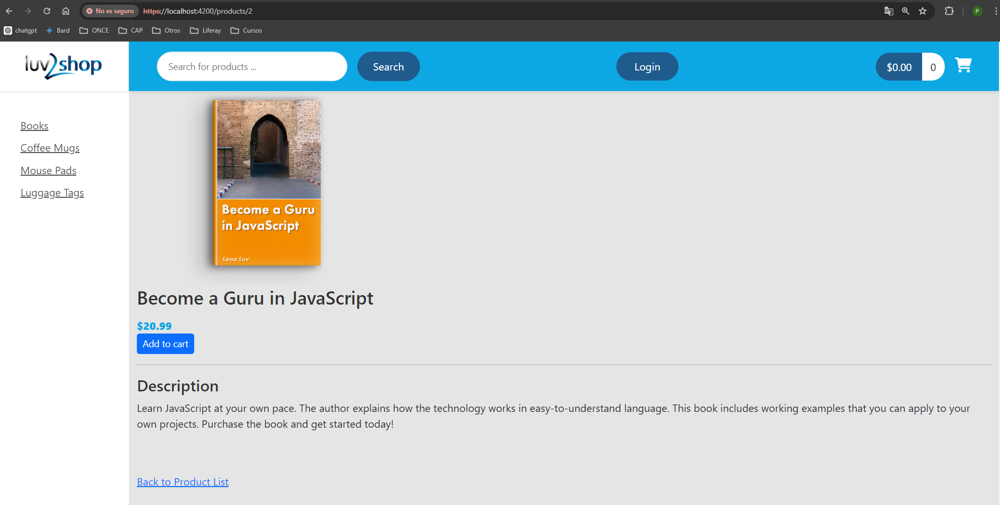
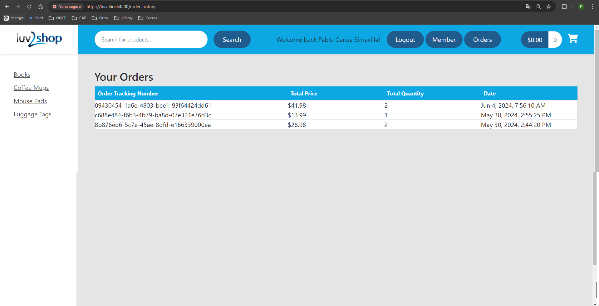
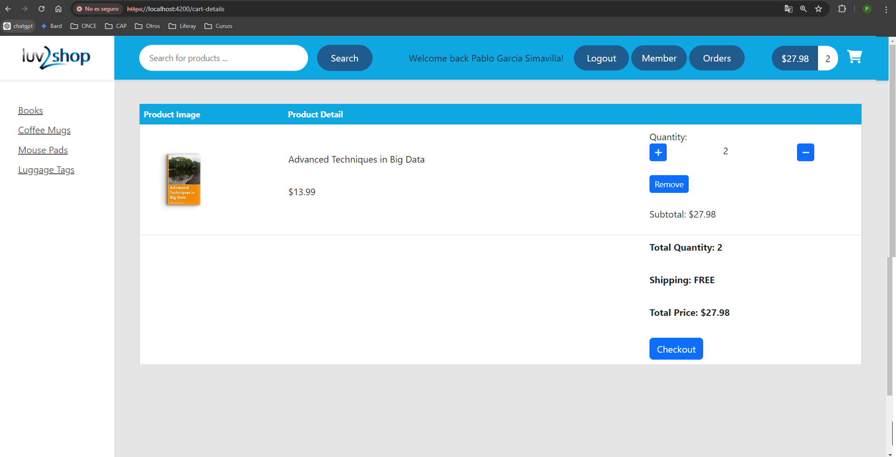
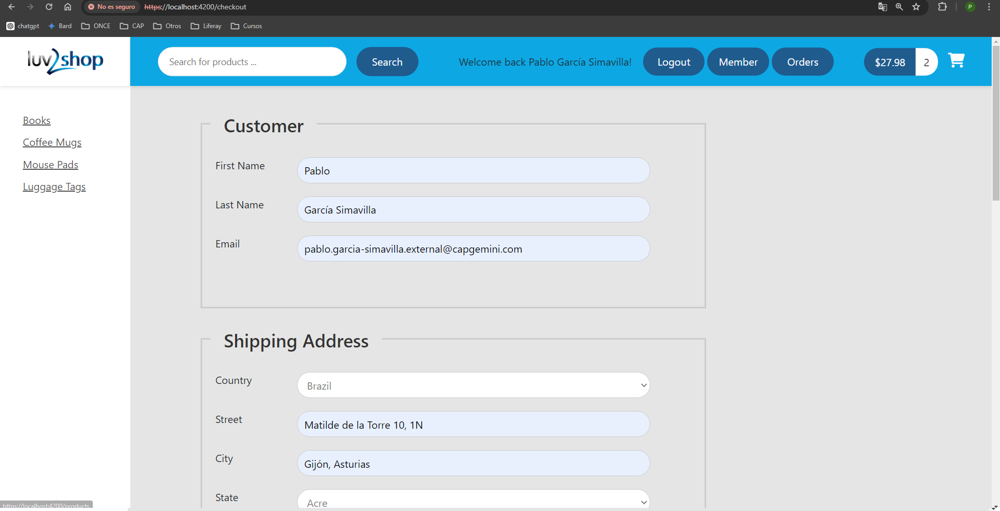
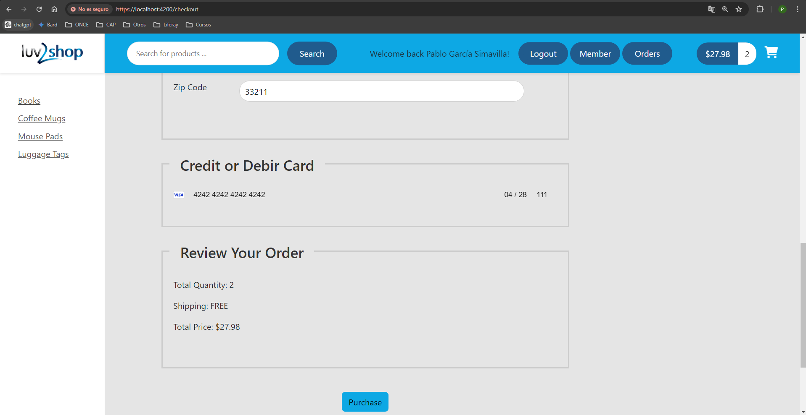

# Full Stack: Angular and Java Spring Boot E-Commerce Website

This Full stack project is based on Udemy course "Full Stack: Angular and Java Spring Boot E-Commerce Website"  by [Chad Darby](https://www.udemy.com/user/chaddarby2/)

## Features

- **User Authentication**: Utilizes Okta and Spring Security for authentication and authorization.
- **Product Catalog**: Product catalog includes pagination and search by product name.
- **Shopping Cart**: Users can add products to the cart and checkout seamlessly.
- **Payment Integration**: Utilizes stripe payment server.
- **Responsive design**

## Technologies 

- Angular: 14.1.1
- Apache Mavem.
- Apache Maven
- Hibernate
- Spring Boot 3.1.11
- Spring Data
- Spring core
- Spring security
- Java 17
- Typescript
- Okta
- Stripe
- MySQL

## Interfaces 

### Login

### Successfull login

### Product catalog

### Product detail

### Orders history

### Cart

### Checkout

### Checkout

## Demo
